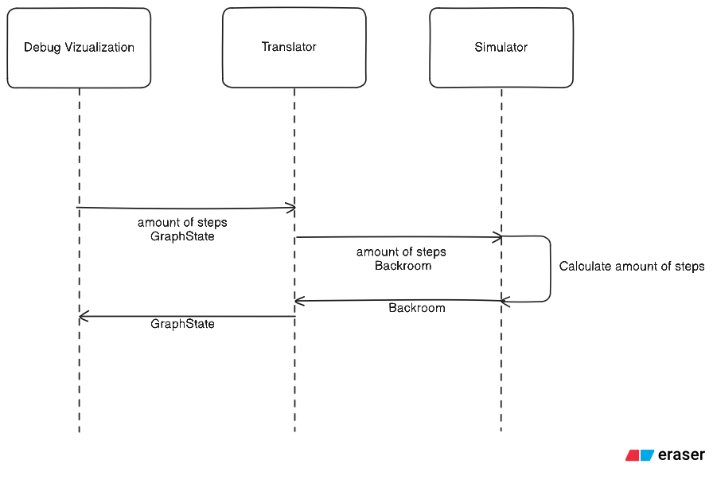

# Контекст
Актуальной целью проекта является разработка *прототипа* химического симулятора с интерфейсом визуализации и отладки. Симулятор призван имитировать цепь химического производства. Так как разрабатывается пока *прототип* имитация отдалена от действительности и сводится к просчету передвежения условного вещества по линии производства от установки к установке. Через интерфейс отладки пользователь может пронаблюдать каждый шаг симуляции (проход от вещества по установкам) также через интерфейс он может добавить, убрать или изменить связи установок, после чего симулятор подхватит изменения и учтет их в процессе просчета следующего шага.

# Схема производства и его модель
Поскольку целью на данный момент является создание *прототипа* схема производства в нем предстваляяет некую произвольную цепь состоящую из соединенных между собой установок по которым перетекает некоторое вещество. Также пользовательский интерфейс подразумевает свободное редактирование производственной цепи.

# Сущности и типы
Данный проект разделен на 2 большие сущности `Simulator` и `DebugVizualization`, также между ними есть сущность `Translator`, отвечающая за взаимодейстиве между ними

Схема взаимодействия:

Далее подробнее о сущностях и их взаимодействии
## Simulator
Симулятор отвечает за моделирование цепи производства. Он имеет следующие поля

### Backroom 
Хранит список `объектов` химического производства выставленных пользователем.  

Имеет метод `Step`, который просчитывает один шаг симуляции. Программа проходится по каждому `объекту` в списке и вызывает просчет его сотояния

#### `Объект` (в прототипе `Pipe`,`YJoin`,`YSplit`) 
представляет собой элемент химического производство через который проходит вещество. Имеет поля
* `state` хранит информацию о его состоянии (колличество вещества, тип вещества)
* `valves` звязи с другими объектами (входящие, исходящие). Также `valve` может быть закрыт что блокирует подачу вещества но оставляет связь между объектами

Также имеет метод `Step`, который просчитывает текущее состояние `объекта` в зависимости от других связанных с ним через входящую связь.
    Метод Step() для Pipe: получает N единиц вещества от предыдущего узла по открытому соединению

## DebugVizualization
Отвечает за визуализацию цепи производства в виде графа где вершины - `объекты`, а ребра - `valves`. Информацию хранит в виде `Графа состояния`

Имеет следующие методы:
* Render - отображает пользовательский интерфейс с текущим состоянием графа и возможностью изменить связи между вершинами, добавить новые вершины или удалить старые.
* MakeStep - отправляет измененный граф состояния в `Simulator` через `Translator` и готовится получить от симулятора новый граф состояния, просчитанный на шаг дальше

### Граф состояния
Для возможности независимой работы данные визуализатор хранит в качестве своего класса под названием граф состояния. Это позволяет работать производить редактирование вне зависимости от симулятора и потом отправлять готовый резултат туда.

Граф имеет поля 
* `Nodes` - вершины полученые из `объектов`
* `Edges` - ребра созданые из `valves`

Методы
* Добавить вершину
* Изменить/добавить ребро
* Удалить вершину

## Translator
Обеспечивает преобразование данных с симулятора (поле `Backroom`) в граф состояния и наоборот. Также отвечает за одновременный запуск симулятора с визуализацией.

# Use Case

# Что есть (на начало недели)
Моей задачей является создание визуализатора и `Translator`а. На данный момент готова базовая отрисовка графа состояния, однако она не связана с симулятором и не предоставляет возможность редактирования графа состояния.

# Что будет
За время практики визуализатор получит возможность редактировать граф состояния. Будет написан `Translator`, и состыкован с `DebugVizualization` и `Simulator`. Что предоставит возможность отладки на дальнейших ступенях проекта. В будущем производственная цепь станет ближе к реальной. А дебаговый визуализатор смениться на игровой движок.

# Отличия от реальности
Так как ближайшей целью является прототип его можно назвать довольно условным. Перетекает некое вещество а из установок у нас труба, разделитель и соединитель. Приведение к имитации реальной схемы производства - дальнейший план, в котором будут учитывать хим. реакции и полноценная производственная техника безопасности.